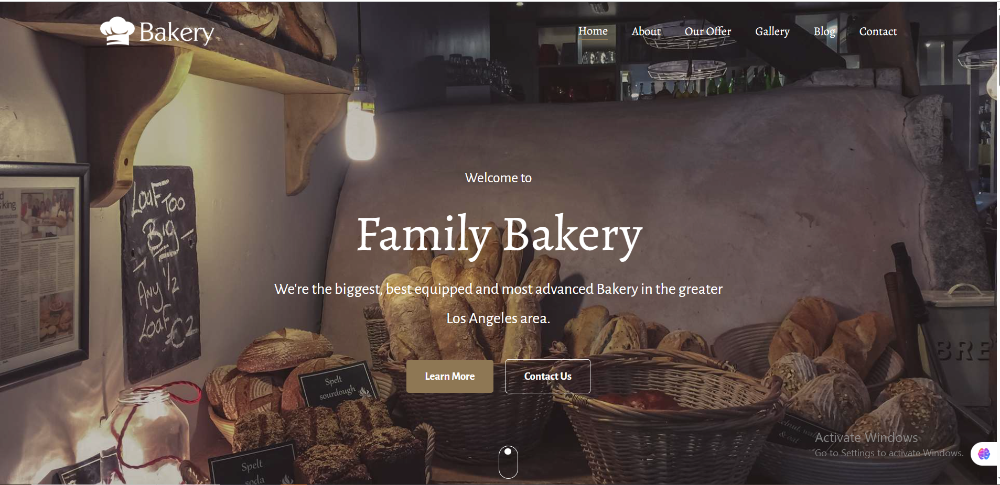
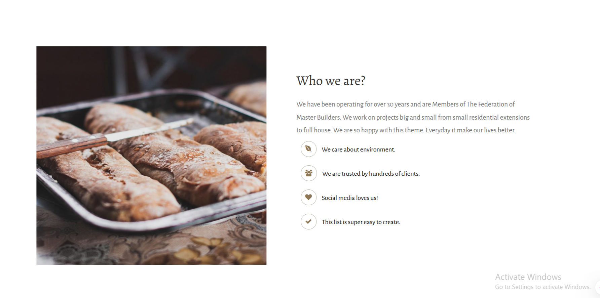
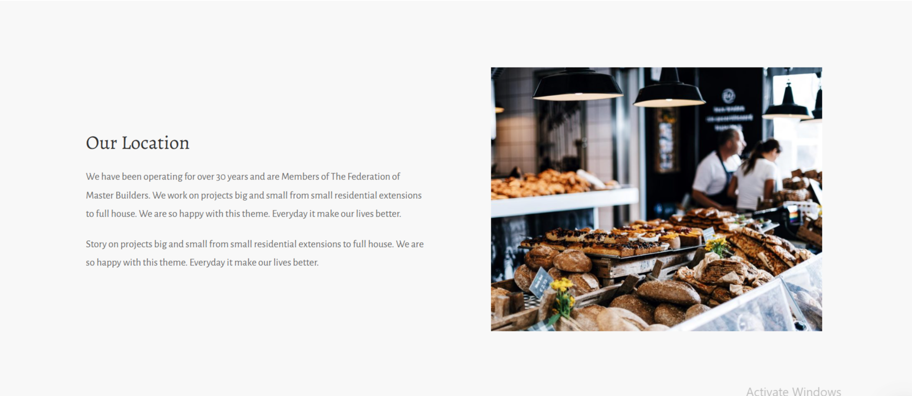
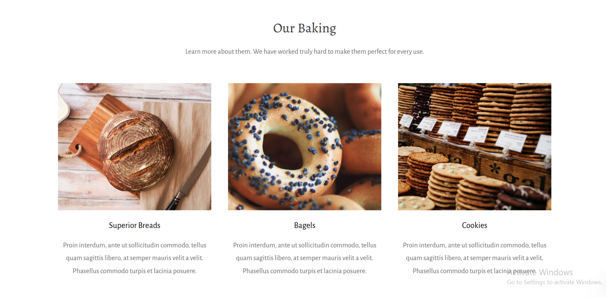
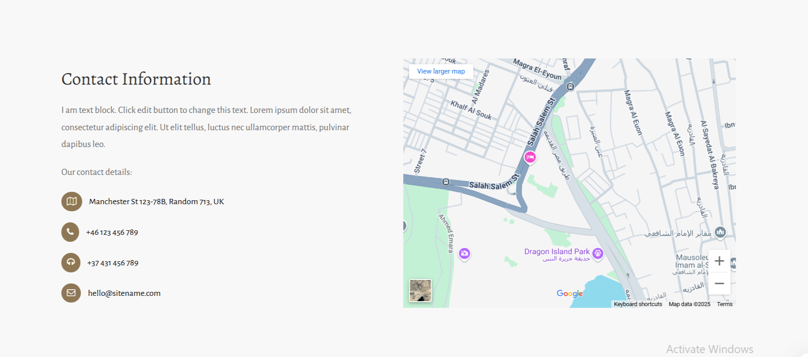
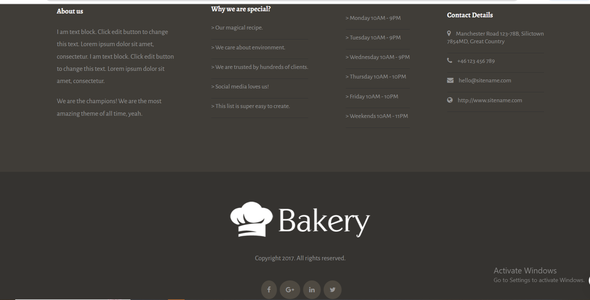

# Bakery Website Documentation



## Table of Contents

1. [Project Overview](#project-overview)
2. [Features](#features)
3. [Technologies Used](#technologies-used)
4. [File Structure](#file-structure)
5. [Code Explanation](#code-explanation)
6. [Responsive Design](#responsive-design)
7. [Development Notes](#development-notes)
8. [License](#license)

## Project Overview

A responsive bakery website built with HTML5, CSS3, and JavaScript. The site showcases bakery products with elegant design and smooth user experience.

## Features

- **Responsive Layout**: Adapts to all screen sizes
- **Modern Design**: Clean aesthetic with appealing visuals
- **Interactive Elements**:
  - Mobile-friendly navigation
  - Hover effects
  - Smooth scrolling
- **Optimized Assets**:
  - Compressed images
  - Efficient CSS
- **SEO Ready**:
  - Semantic HTML
  - Meta tags
  - Structured data

## Technologies Used

| Technology   | Purpose               |
| ------------ | --------------------- |
| HTML5        | Structure and content |
| CSS3         | Styling and layout    |
| JavaScript   | Interactive elements  |
| Font Awesome | Icons                 |
| Google Fonts | Typography            |
| Git          | Version control       |

---

## File Structure


```

Bakery-Website/

│

├── index.html

├── README.md

├── CSS/

│ └── style.css

├── JS/

│ └── main.js

├── images/

│ ├── bakery-light-1.png

│ ├── alexandru-stavrica-170390-800x760.jpg

│ ├── clem-onojeghuo-206832-600x500.jpg

│ ├── ben-garratt-134774-600x500.jpg

│ ├── stas-ovsky-123540-600x500.jpg

│ └── full-2-800x640.jpg


```

---

## Code Explanation (Section by Section)

### HTML Structure

- **`<head>`**: Contains meta tags for SEO, fonts, icons, and links to external styles.
- **`.container`**: The main wrapper for the website content.
- **`.header`**: Hero section with background image, title, subtitle, and buttons.
- **`.nav-bar`**: Navigation bar with logo and menu links.
- **`.about-us-section`**: Flex section showing a photo and content with icons and list.
- **`.loc-section`**: Our Location section with image and text side-by-side.
- **`.products-section`**: Card-based layout for 3 featured products (bread, bagels, cookies).
- **`.map-section`**: Contact section with address, phone, email, and embedded Google Map.
- **`.footer-section`**: Four-column footer with links, about info, hours, and contact details.
- **`.second-footer`**: Copyright & social media.

---

### CSS Structure

- **`:root`**: CSS variables for colors, fonts, and layout settings.

## :root CSS Variables

| Variable Name       | Value                           | Description / Usage                              |
| ------------------- | ------------------------------- | ------------------------------------------------ |
| `--main-color`      | `#8E7754`                       | Main accent color (used in buttons, icons, etc.) |
| `--secondary-color` | `#969696`                       | Secondary color (text, icons, etc.)              |
| `--light-color`     | `#ffffff`                       | Light/white color (used in text or backgrounds)  |
| `--dark-color`      | `#303030`                       | Dark color for headings and backgrounds          |
| `--heading-color`   | `#303030`                       | Used for headings like `<h1>`, `<h2>`            |
| `--text-color`      | `#686868`                       | Default paragraph color                          |
| `--btn-hover-bg`    | `#ffffff`                       | Background color on button hover                 |
| `--btn-hover-color` | `#000`                          | Text color on button hover                       |
| `--border-radius`   | `4px`                           | Rounded corners for buttons and icons            |
| `--box-shadow`      | `0 4px 12px rgba(0, 0, 0, 0.1)` | Shadow for depth effect                          |
| `--font-small`      | `14px`                          | For small text                                   |
| `--font-base`       | `16px`                          | Base font size                                   |
| `--font-lg`         | `24px`                          | Large text like subheadings                      |
| `--font-xl`         | `36px`                          | Extra large text like main titles                |

---

- **Reset Rules**: `*`, `body`, `a`, `li` – reset default styles.
- **Utility Classes**:
  - `.Box`: Centered fixed-width section with margin.
  - `.flex`: Flexbox helper to align items horizontally.
- **Header Styling**:
  - Fullscreen background with overlay.
  - Centered text and buttons.
- **Navbar Styling**:
  - Flex layout, logo on left, links on right.
- **About & Location**:
  - Split layout using `flex`.
  - Icon styling with `border-radius` and `padding`.
- **Products Section**:
  - 3 equal cards with images, titles, and descriptions.
- **Map Section**:
  - Icons + embedded iframe map.
- **Footer**:
  - Dark theme with four columns and structured lists.
  - Social media icons in rounded containers.

---

## Responsive Design

``` css
/* Breakpoints */
/* Small phones (<576px) */
@media (max-width: 576px) {
  /* Stacked layout */
  .flex { flex-direction: column; }
  
  /* Simplified navigation */
  .nav-links { display: none; }
  .nav-links.active { display: block; }
  .toggle-menu { display: block; }
  
  /* Adjusted typography */
  h1 { font-size: 42px !important; }
  p { font-size: 16px; }
}

/* Tablets (577-991px) */
@media (min-width: 577px) and (max-width: 991px) {
  /* Two-column product layout */
  .card { width: 45%; }
  
  /* Adjusted spacing */
  .Box { width: 90%; }
}

/* Desktop (992px+) */
@media (min-width: 992px) {
  /* Full three-column layout */
  .card { width: 30%; }
  
  /* Expanded navigation */
  .nav-links { width: 40%; }
}

```
---


## Preview Images

Here are some images from the project:

#### Header section image


#### Why section image



#### location section image



#### products section image



#### map section image



#### footer section image



---

## Author

**Mohamed Sayed Omar El-sayed**  
Faculty of Computers and Information, Fayoum University  
Email: [ms3655@fayoum.edu.eg](mailto:ms3655@fayoum.edu.eg)  
GitHub: [Mohamedsayed101](https://github.com/Mohamedsayed101)
LinkedIn: [Mohamed Sayed ]([https://www.linkedin.com/in/mohamed-sayed-omar/](https://www.linkedin.com/in/mohamed-sayed-439a54347/)

---

## License

This project is developed for learning and personal portfolio use.  
You are free to modify and use the code with proper credit to the author.
